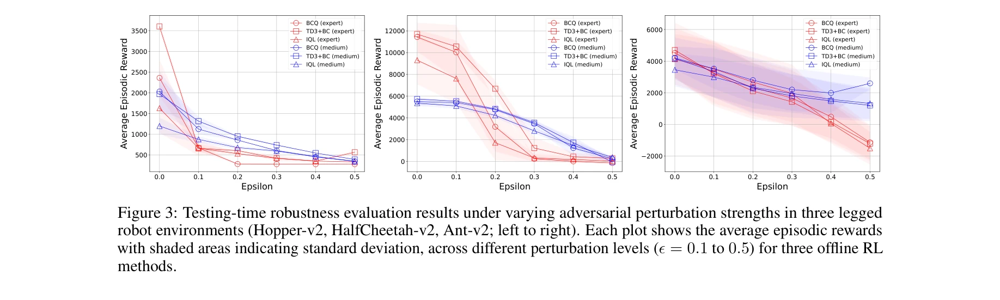
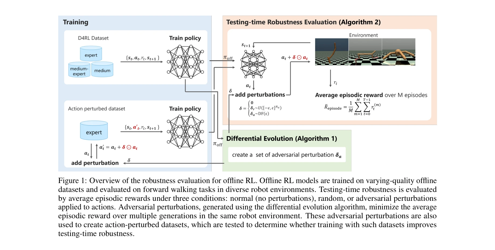

# Robustness evaluation of offline reinforcement learning for robot control against action perturbations

> **저자**: Yogesh K. Dwivedi, Nir Kshetri, Laurie Hughes, Emma Slade, Anand Jeyaraj, Arpan Kumar Kar, Abdullah M. Baabdullah, Alex Koohang, Vishnupriya Raghavan, Manju Ahuja, Hanaa Albanna, Mousa Ahmad Albashrawi, Adil S. Al-Busaidi, Janarthanan Balakrishnan, Yves Barlette, Sriparna Basu, Indranil Bose, Laurence Brooks, Dimitrios Buhalis, Lemuria Carter | **날짜**: 2024 | **URL**: [https://arxiv.org/abs/2412.18781](https://arxiv.org/abs/2412.18781)

---

## Essence

*Figure 3: Testing-time robustness evaluation results under varying adversarial perturbation strengths in three legged*

본 논문은 오프라인 강화학습(Offline RL) 방법들의 행동 섭동(action perturbation)에 대한 견고성을 평가하며, 기존 방법들이 온라인 RL보다 더 취약함을 보여준다.

## Motivation

- **Known**: 온라인 RL은 환경과의 직접 상호작용을 통해 광범위한 탐색이 가능하며, 도메인 랜더마이제이션과 적대적 훈련으로 현실 갭을 해결할 수 있다. 오프라인 RL은 보수적 훈련을 통해 Q-value 과대평가를 완화한다.
- **Gap**: 기존 오프라인 RL 견고성 연구는 상태 공간 섭동에 집중했으나, 로봇의 작동기 고장 같은 행동 공간 섭동에 대한 견고성은 탐구되지 않았다. 행동 섭동은 정책 네트워크의 출력에 직접 영향을 미치므로 별도의 분석이 필요하다.
- **Why**: 로봇 제어 실제 응용에서 작동기 고장이나 신호 왜곡 같은 행동 섭동은 시스템 신뢰성을 위협하는 핵심 문제이며, 오프라인 RL의 실용성 확대를 위해 이에 대한 견고성 이해가 필수적이다.
- **Approach**: MuJoCo 시뮬레이션에서 BCQ, TD3+BC, IQL 등 기존 오프라인 RL 방법들을 평가하고, random 및 adversarial perturbation(differential evolution 기반)을 행동에 주입하여 테스트 시간 견고성을 측정한다. 섭동된 데이터셋으로 학습한 정책의 견고성도 평가한다.

## Achievement

*Figure 3: Testing-time robustness evaluation results under varying adversarial perturbation strengths in three legged*

- **오프라인 RL의 취약성 입증**: 기존 오프라인 RL 방법들이 행동 섭동에 대해 온라인 RL보다 현저히 더 취약함을 정량적으로 보여줌
- **데이터셋 커버리지와의 연관성**: 오프라인 RL의 테스트 시간 견고성이 학습 데이터셋의 상태-행동 커버리지에 의존함을 실증
- **섭동 데이터 증강의 한계**: 섭동된 데이터셋으로 학습해도 테스트 시간 견고성 개선이 미미함을 증명, 더 나은 오프라인 RL 방법 필요성 강조

## How

*Figure 1: Overview of the robustness evaluation for offline RL. Offline RL models are trained on varying-quality offline*

- OpenAI Gym의 Hopper-v2, HalfCheetah-v2, Walker2d-v2 등 다리 로봇 환경에서 실험 수행
- D4RL 데이터셋(expert, medium, medium-expert)을 사용하여 BCQ, TD3+BC, IQL 방법 평가
- Random perturbation과 differential evolution 기반 adversarial perturbation을 joint torque 신호에 적용
- 평균 episodic reward를 주요 성과 지표로 사용하여 견고성 평가
- 행동 섭동을 포함한 증강 데이터셋으로 정책 재학습 후 견고성 재평가
- 온라인 RL(PPO, SAC)과의 비교를 통해 상대적 취약성 분석

## Originality

- 오프라인 RL에서 행동 공간 섭동에 대한 견고성을 처음으로 체계적으로 평가한 연구
- Interactive access를 가정하지 않는 differential evolution 기반 적대적 섭동 방법을 오프라인 설정에 적용
- 보수적 정책 제약(BCQ, TD3+BC)과 값 함수 정규화(IQL) 방법들의 견고성을 비교 분석
- 데이터셋 커버리지와 견고성의 연관성을 실증적으로 입증한 점

## Limitation & Further Study

- 실험이 MuJoCo 시뮬레이션 환경에 제한되어 있으며, 실제 로봇 하드웨어에서의 검증 부재
- Differential evolution 기반 적대적 섭동만 사용하여 다양한 공격 방식에 대한 평가 부족
- 섭동 데이터로 학습해도 견고성이 개선되지 않는 이유에 대한 심층적 분석 미흡
- 오프라인 RL의 견고성 향상을 위한 새로운 알고리즘 제안이 없고, 문제 제시만 수행
- 후속 연구로 보수적 정책 제약의 완화와 견고성 간의 trade-off 분석, 적응형 행동 섭동 학습 방법 개발 필요

## Evaluation

- Novelty: 4/5
- Technical Soundness: 3/5
- Significance: 4/5
- Clarity: 4/5
- Overall: 4/5

**총평**: 본 논문은 오프라인 RL의 실제 응용에 중요한 행동 섭동 견고성을 처음 다루었으며, 기존 방법들의 취약성을 명확히 입증했다. 다만 해결책 제시 부족과 시뮬레이션 환경 제한이 아쉬우나, 향후 견고한 오프라인 RL 개발을 위한 중요한 벤치마크 연구로 가치가 높다.

## Related Papers

- 🔗 후속 연구: [[papers/422_Improving_generalization_of_robot_locomotion_policies_via_sh/review]] — 오프라인 RL의 견고성 문제가 샤프니스 인식 최적화를 통해 해결될 수 있는 가능성을 제시한다.
- 🏛 기반 연구: [[papers/891_Zero-shot_sim-to-real_transfer_for_reinforcement_learning-ba/review]] — 오프라인 RL의 견고성 평가가 심-투-리얼 전이에서 중요한 벤치마크 역할을 할 수 있다.
- 🧪 응용 사례: [[papers/050_Adasociety_An_adaptive_environment_with_social_structures_fo/review]] — 오프라인 RL 방법들의 견고성이 적응형 다중 에이전트 환경에서 평가될 수 있다.
- 🏛 기반 연구: [[papers/395_Guided_by_guardrails_Control_barrier_functions_as_safety_ins/review]] — 오프라인 RL의 행동 섭동 취약성이 제어 장벽 함수 기반 안전성 제약의 필요성을 보여준다.
- 🔗 후속 연구: [[papers/211_ChemGymRL_A_Customizable_Interactive_Framework_for_Reinforce/review]] — 화학 실험 강화학습에서 오프라인 강화학습의 견고성 평가라는 더 실용적인 적용으로 발전한다
- 🏛 기반 연구: [[papers/891_Zero-shot_sim-to-real_transfer_for_reinforcement_learning-ba/review]] — 제로샷 심-투-리얼 전이가 오프라인 RL의 견고성 평가에서 중요한 벤치마크가 될 수 있다.
- 🧪 응용 사례: [[papers/395_Guided_by_guardrails_Control_barrier_functions_as_safety_ins/review]] — CBF 기반 안전성 제약이 오프라인 RL의 행동 섭동에 대한 견고성 평가에 활용될 수 있다.
- 🏛 기반 연구: [[papers/422_Improving_generalization_of_robot_locomotion_policies_via_sh/review]] — 샤프니스 인식 최적화가 오프라인 RL의 행동 섭동에 대한 견고성 향상에 기여할 수 있다.
- 🏛 기반 연구: [[papers/140_Autonomous_reinforcement_learning_agent_for_chemical_vapor_d/review]] — 오프라인 강화학습의 견고성 평가가 CVD 에이전트의 오프라인 RL 방법론 적용에 이론적 기반을 제공한다.
- 🧪 응용 사례: [[papers/050_Adasociety_An_adaptive_environment_with_social_structures_fo/review]] — 적응형 환경이 오프라인 RL 방법들의 견고성을 평가하는 벤치마크로 활용될 수 있다.
