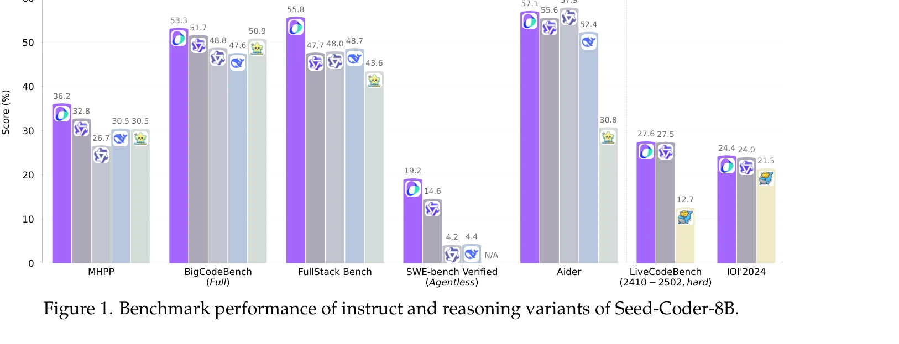

# Seed-coder: Let the code model curate data for itself

> **저자**: ByteDance Seed, Yuyu Zhang, Jing Su, Yifan Sun, Chenguang Xi, Xia Xiao, Zheng Shen, A. Q. Zhang, Kaibo Liu, Daoguang Zan, Tao Sun, J. Zhu, Shijie Xin, Dong Huang, Y. Bai, Lixin Dong, C. J. Li, Jianchong Chen, Hao Zhou, Yifan Huang | **날짜**: 2025 | **URL**: [https://arxiv.org/abs/2506.03524](https://arxiv.org/abs/2506.03524)

---

## Essence

*Figure 2. Processing pipeline for pretraining data. We collected data from GitHub and web archives.*

Seed-Coder는 손수 작성한 필터링 규칙 대신 LLM 기반 점수 매기기 및 필터링을 사용하는 모델 중심 데이터 파이프라인으로 코드 사전학습 데이터를 자동으로 큐레이션하며, 8B 규모의 기본·명령·추론 모델을 제시한다.

## Motivation

- **Known**: 코드 데이터는 LLM 사전학습에서 중요하며, 기존 오픈소스 모델들은 hand-crafted 필터링 규칙이나 인간 주석 데이터로 코드 품질을 관리해왔다.
- **Gap**: Hand-crafted 규칙은 확장성이 제한되고, 주관적 편향이 있으며, 다양한 프로그래밍 언어에 걸쳐 유지보수 비용이 높다.
- **Why**: 모델 중심 데이터 파이프라인은 인간 개입을 최소화하면서도 코드 품질의 미묘한 기준을 포착할 수 있으며, 수십억 개 샘플을 일관되게 처리할 수 있다.
- **Approach**: LLM을 활용한 품질 점수 매기기 및 필터링으로 GitHub, 커밋, 웹 데이터에서 6조 토큰 규모의 사전학습 말뭉치를 생성하고, 지도 미세조정과 DPO, LongCoT 강화학습으로 세 가지 모델 변형을 개발한다.

## Achievement

*Figure 1. Benchmark performance of instruct and reasoning variants of Seed-Coder-8B.*

- **모델 중심 데이터 파이프라인**: LLM 기반 품질 필터를 통해 손수 작성한 규칙에 비해 확장 가능하고 객관적인 데이터 큐레이션 실현
- **벤치마크 성능**: MHPP, BigCodeBench, FullStack Bench, SWE-bench Verified 등 다양한 벤치마크에서 8B 규모 경쟁 모델들을 능가하고 더 큰 모델과도 경쟁
- **다양한 코딩 능력**: 코드 생성, 코드 완성, 코드 편집, 코드 추론, 소프트웨어 엔지니어링 작업 전반에서 우수한 성과
- **세 가지 모델 변형**: Base, Instruct, Reasoning 모델을 통한 다양한 사용 시나리오 지원

## How

*Figure 2. Processing pipeline for pretraining data. We collected data from GitHub and web archives.*

- GitHub 데이터, 커밋 기록, 코드 관련 웹 데이터에서 raw 데이터 수집
- 정확 및 근사 중복 제거(exact and near-deduplication) 수행
- LLM 기반 품질 점수 매기기로 파일 수준 및 저장소 수준 코드 필터링
- High-quality 데이터와 Long-context 데이터를 별도로 처리하여 계속 사전학습(continued pretraining) 단계 준비
- Instruct 모델: LLM 생성 및 필터링된 합성 데이터로 지도 미세조정, DPO로 선호 최적화
- Reasoning 모델: LongCoT 강화학습으로 다단계 코딩 추론 능력 강화
- Sandbox 검증을 통한 자기 수정(self-correction) 적용

## Originality

- Hand-crafted 규칙 기반 필터링의 근본적인 대안으로 LLM 중심 큐레이션 제안, 'The Bitter Lesson' 철학에 부합하는 확장 가능한 접근", '병렬 처리 파이프라인 설계로 순차 종속성 제거하여 증분 데이터 확장과 유연한 파이프라인 조작 지원
- LongCoT 강화학습을 활용한 다단계 코딩 추론 개선 방식
- 코드 품질 점수 매기기를 위한 LLM 기반 평가 체계의 구체적 구현 및 검증

## Limitation & Further Study

- 8B 규모 모델로 제한되어 있으며, Claude 3.5 Sonnet이나 OpenAI o3와 같은 대규모 모폐쇄형 모델과의 직접 비교는 제한적
- LLM 기반 품질 필터의 신뢰성이 필터로 사용되는 LLM 자체의 능력에 의존하며, 순환 편향(circular bias) 가능성
- Decontamination 절차의 상세 설명 부족으로 재현성 검증 어려움
- 후속 연구: (1) 더 큰 규모의 모델에 대한 접근법 검증, (2) LLM 필터의 편향성 분석 및 개선, (3) 다양한 도메인 코드에 대한 일반화 능력 평가

## Evaluation

- Novelty: 4/5
- Technical Soundness: 3/5
- Significance: 4/5
- Clarity: 4/5
- Overall: 4/5

**총평**: Seed-Coder는 코드 사전학습 데이터 큐레이션의 패러다임을 hand-crafted 규칙에서 LLM 기반 자동화로 전환하며, 실용적이면서도 강력한 8B 모델을 통해 이 접근법의 효과를 명확히 입증한다. 확장 가능성과 객관성 측면에서 중요한 기여이나, 대규모 모델 및 필터 편향 분석에 대한 추가 탐구가 필요하다.

## Related Papers

- 🔄 다른 접근: [[papers/690_Rule-based_neural_and_llm_back-translation_Comparative_insig/review]] — 데이터 큐레이션에서 LLM 기반 자동화와 역번역 기법이라는 서로 다른 데이터 품질 향상 접근법을 비교할 수 있다.
- 🔗 후속 연구: [[papers/770_Starcoder_2_and_the_stack_v2_The_next_generation/review]] — Stack v2 데이터셋의 대규모 코드 데이터를 Seed-Coder의 자동 큐레이션 파이프라인으로 더욱 정교하게 필터링할 수 있다.
- 🏛 기반 연구: [[papers/320_Evaluating_Large_Language_Models_in_Scientific_Discovery/review]] — 코드로 훈련된 대형 언어 모델 평가의 기초적인 방법론을 자동 데이터 큐레이션에 적용한다.
- 🔄 다른 접근: [[papers/690_Rule-based_neural_and_llm_back-translation_Comparative_insig/review]] — 저자원 언어 처리에서 역번역과 자동 데이터 큐레이션이라는 서로 다른 데이터 증강 접근법을 비교할 수 있다.
