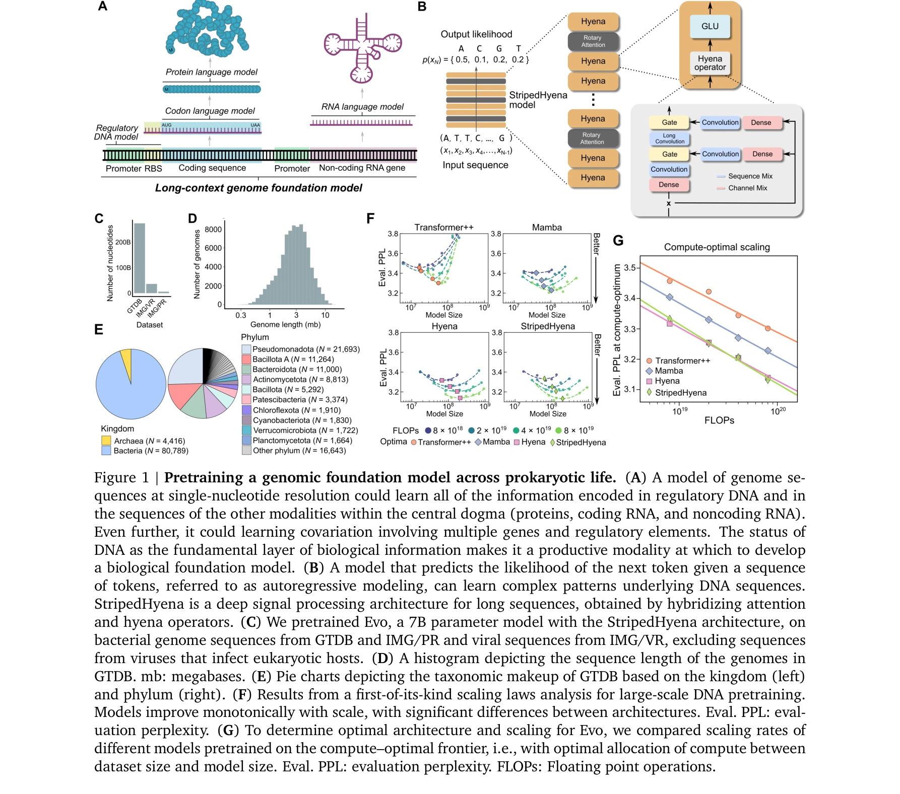

# Sequence modeling and design from molecular to genome scale with Evo

> **저자**: Eric Nguyen, Michael Poli, Matthew G. Durrant, Armin W. Thomas, Brian Kang | **날짜**: 2024 | **DOI**: [10.1101/2024.02.27.582234](https://doi.org/10.1101/2024.02.27.582234)

---

## Essence

*Figure 1 | Pretraining a genomic foundation model across prokaryotic life. (A) A model of genome se-*

Evo는 7억 개 파라미터의 genomic foundation model로서 131kb의 긴 context length에서 단일 nucleotide 해상도로 DNA 서열을 예측하고 생성할 수 있으며, 분자 규모부터 genome 규모까지 다양한 생물학적 작업을 수행한다.

## Motivation

- **Known**: 기존 DNA 언어 모델들은 Transformer 기반으로 제한된 context length와 coarse-grained tokenization을 사용하므로 단일 nucleotide 해상도에서 장문 서열을 모델링하기 어렵다. 또한 기존 생성 모델들은 단일 분자나 짧은 서열 설계에만 제한되어 있다.
- **Gap**: 복합 생물학적 과정(유전자 조절, CRISPR 면역, 유전 전이 등)은 여러 modality에 걸친 분자 상호작용을 포함하지만, 이를 통합적으로 모델링하고 multi-component 시스템 설계를 수행할 수 있는 foundation model이 부재하다. 특히 전체 genome 규모에서 장문 서열 생성이 가능한 모델이 없다.
- **Why**: 단일 foundation model로 DNA, RNA, 단백질의 상호작용을 학습하면 생물학적 이해와 제어 능력을 획기적으로 향상시킬 수 있으며, 합성 생물학 및 생물 공학 분야의 응용 가능성을 크게 확대할 수 있다.
- **Approach**: StripedHyena 아키텍처(hyena convolutional layers와 attention layers의 하이브리드)를 사용하여 단일 nucleotide tokenization으로 131kb context length에서 효율적으로 장문 서열을 처리하며, 2.7M개의 prokaryotic 및 phage genome에서 사전학습한다.

## Achievement

- **Zero-shot 함수 예측**: E. coli 단백질의 변이 영향 예측에서 SOTA 단백질 언어 모델과 경쟁력 있는 성능 달성; noncoding RNA 변이 예측에서 전문화된 RNA 언어 모델 능가
- **Multi-component 생물학적 시스템 생성**: CRISPR-Cas 분자 복합체와 transposable element 시스템 생성 (처음 시도); 다중 요소 간의 co-evolutionary linkage 학습 가능
- **Genome 규모 생성**: 650kb 길이의 coding-rich 서열 생성으로 기존 방법보다 수 배에서 수십 배 이상 긴 서열 생성 가능
- **유전자 필수성 예측**: nucleotide 해상도에서 bacteria/bacteriophage의 필수 유전자 비지도 예측 가능
- **Cross-modality 학습**: DNA 기반 단일 foundation model이 단백질, coding RNA, noncoding RNA modality를 통합적으로 모델링

## How

*Figure 1 | Pretraining a genomic foundation model across prokaryotic life. (A) A model of genome se-*

- StripedHyena 아키텍처: 29개의 hyena convolutional layer와 3개(10%)의 multi-head attention layer(RoPE 포함) 하이브리드 구성
- Hyena layer: 짧고 긴 convolution filter의 합성으로 입력 의존적 시퀀스 처리로 노이즈 필터링 및 motif 집계
- Byte-level single-nucleotide tokenization으로 131kb(131,072 token) context length 구현
- 2.7M prokaryotic genome(GTDB, IMG/PR) + phage genome(IMG/VR) 데이터셋 사용(총 300억 nucleotide)
- Autoregressive pretraining으로 다음 token 예측 학습
- Zero-shot 평가: 미세조정 없이 직접 downstream task 수행
- Finetuning: CRISPR-Cas, IS200/IS605 transposable element 서열에 대해 생성 설계 수행
- 계산 최적화된 scaling law 분석으로 아키텍처 선정

## Originality

- DNA foundation model로서 처음으로 단일 nucleotide 해상도에서 131kb context length 달성
- Transformer 기반이 아닌 StripedHyena 하이브리드 아키텍처를 DNA 모델에 적용하여 computational efficiency와 long-range pattern 학습 병립
- multi-component 생물학적 시스템(CRISPR-Cas, transposable element) 생성의 처음 시도
- DNA-centric foundation model로 protein, RNA 등 여러 modality의 기능 예측을 zero-shot으로 수행
- Prokaryotic genome 규모의 대규모 사전학습으로 co-evolutionary 정보와 genome-level 패턴 학습

## Limitation & Further Study

- Prokaryotic 및 phage 데이터셋만 학습하였으므로 eukaryotic genome 적용의 한계
- 생성된 서열의 실제 생물학적 기능 및 독성(toxicity) 검증이 제한적; in vitro/in vivo 실험 검증 필요
- 131kb context length가 매우 큰 genomic region(예: 수 megabase)을 모델링하기에는 여전히 부족할 수 있음
- Zero-shot 성능이 우수하나 특정 도메인에 대한 finetuning 효과와 데이터 효율성에 대한 분석 부족
- 후속연구: Eukaryotic genome으로 확장; 생성 서열의 기능적 검증 자동화; 더 긴 context length 기술 개발; domain-specific adaptation 전략

## Evaluation

- Novelty: 4/5
- Technical Soundness: 4/5
- Significance: 4/5
- Clarity: 4/5
- Overall: 4/5

**총평**: Evo는 StripedHyena 아키텍처와 단일 nucleotide 해상도를 통해 긴 genomic context에서 예측과 생성을 수행하는 혁신적인 genomic foundation model이며, zero-shot 함수 예측에서 SOTA 성능 달성과 multi-component 생물학적 시스템 설계 가능성을 입증하여 합성생물학 분야에 중대한 기여를 한다.

## Related Papers

- 🔄 다른 접근: [[papers/459_Language_Models_for_Controllable_DNA_Sequence_Design/review]] — DNA 서열 설계를 위한 언어 모델 접근법으로, Evo의 genomic foundation model과 동일한 문제를 다른 관점에서 해결한다.
- 🔗 후속 연구: [[papers/472_Large_language_models_design_sequence-defined_macromolecules/review]] — Evo의 DNA 서열 생성 능력을 macromolecule 설계로 확장한 연구로, 분자 설계 응용 범위를 넓혔다.
- 🏛 기반 연구: [[papers/345_Foundation_Molecular_Grammar_Multi-Modal_Foundation_Models_I/review]] — Evo의 multi-modal foundation model 구조의 이론적 기반을 제공하는 분자 문법 연구이다.
- 🏛 기반 연구: [[papers/720_Scientific_Large_Language_Models_A_Survey_on_Biological__Che/review]] — Evo와 같은 생물학적 대규모 언어 모델의 전반적인 설계 원리와 방법론적 기초를 제공한다.
- 🧪 응용 사례: [[papers/795_The_AI_Scientist_Towards_Fully_Automated_Open-Ended_Scientif/review]] — Evo의 genomic modeling 능력을 실제 과학적 발견에 적용하는 자동화된 연구 시스템의 사례이다.
- 🔗 후속 연구: [[papers/302_Effective_gene_expression_prediction_from_sequence_by_integr/review]] — 유전자 발현 예측을 분자부터 게놈 규모까지 확장한 시퀀스 모델링 연구
- 🔗 후속 연구: [[papers/686_Robust_deep_learning_based_protein_sequence_design_using_Pro/review]] — 분자에서 게놈 규모까지의 서열 모델링과 설계가 ProteinMPNN의 단백질 서열 설계를 더 큰 규모로 확장한다.
