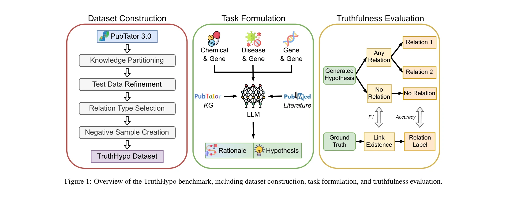

# Toward reliable biomedical hypothesis generation: Evaluating truthfulness and hallucination in large language models

> **저자**: Shawn E. Christ, David C. Van Essen, Joanne Watson, L. E. Brubaker, Kathleen B. McDermott | **날짜**: 2025 | **DOI**: [10.24963/ijcai.2025/873](https://doi.org/10.24963/ijcai.2025/873)

---

## Essence

*Figure 1: Overview of the TruthHypo benchmark, including dataset construction, task formulation, and truthfulness evalua*

LLM이 생성한 생의학 가설의 진실성을 평가하기 위해 TruthHypo 벤치마크와 KnowHD 할루시네이션 탐지 프레임워크를 제안하고, 기존 지식 기반 접지도(groundedness) 점수가 신뢰할 수 있는 가설 필터링에 효과적임을 보인다.

## Motivation

- **Known**: LLM은 과학 문헌 분석을 통해 새로운 가설 생성에 유용하지만, 할루시네이션 문제로 인해 그럴듯해 보이지만 부정확한 가설을 생성할 수 있다. 기존 연구는 생성된 가설의 참신성과 다양성에 중점을 두었다.
- **Gap**: LLM이 생성한 가설의 진실성과 기존 지식에 대한 접지도를 체계적으로 평가할 수 있는 벤치마크와 할루시네이션 탐지 방법이 부족하다. 추론 과정에서의 할루시네이션과 최종 가설의 진실성 간의 연관성이 밝혀지지 않았다.
- **Why**: 생의학 분야에서 LLM을 신뢰할 수 있는 과학 발견 도구로 활용하려면 생성된 가설의 정확성을 검증하는 것이 필수적이고, 이는 연구자의 시간과 자원을 절약할 수 있다.
- **Approach**: PubTator 3.0 지식 그래프와 생의학 말뭉치를 기반으로 TruthHypo 벤치마크를 구축하고, LLM의 추론 과정을 분석하여 할루시네이션된 주장을 탐지하는 KnowHD 프레임워크를 개발한다. 구조화된 지식(KG), 비구조화된 정보(RAG), 또는 둘 다를 활용한 다양한 설정에서 평가를 수행한다.

## Achievement

*Figure 3: Mean accuracy corresponding to different levels of groundedness. Hypotheses are grouped based on their grounde*

- **TruthHypo 벤치마크**: Chemical & Gene, Disease & Gene, Gene & Gene 세 가지 관계 유형에 대해 총 2024개 인스턴스로 구성된 생의학 가설 생성 평가 벤치마크를 구축
- **KnowHD 프레임워크**: LLM의 추론 과정을 분석하여 할루시네이션을 탐지하고 가설의 접지도를 평가하는 지식 기반 방법 제안
- **할루시네이션-진실성 연관성**: 접지도 점수가 LLM 출력에서 진실한 가설을 필터링하는 효과적인 신호임을 실증적으로 입증
- **인간 평가 검증**: 개방형 가설 생성 작업에 대한 인간 평가를 통해 KnowHD의 과학적 타당성 식별 효용성 확인

## How

*Figure 1: Overview of the TruthHypo benchmark, including dataset construction, task formulation, and truthfulness evalua*

- PubTator 3.0에서 2023년 이전(seen) 및 2024년 이후(unseen) 논문의 관계를 분할하여 시간적 진행 상황 시뮬레이션
- 세 가지 관계 유형(Chemical & Gene, Disease & Gene, Gene & Gene)에 대해 긍정/부정/무관 레이블을 포함한 분류 작업 구성
- 거짓 양성 예측을 평가하기 위해 기존 지식 베이스에 직접 관계가 없는 엔티티 쌍에 대한 음성 샘플 추가
- 매개변수 지식만 사용, KG 기반 구조화된 지식 증강, BM25 기반 RAG, 구조화/비구조화 정보 결합 등 네 가지 설정에서 LLM 평가
- LLM의 생성 근거(rationale)를 분석하여 각 가설의 접지도 점수를 계산하는 KnowHD 메커니즘 적용
- 인간 평가자가 생성된 가설의 과학적 타당성을 판단하여 정량적 평가와 비교 검증

## Originality

- 생의학 영역에서 LLM 기반 가설 생성의 진실성을 평가하는 최초의 체계적 벤치마크 제시
- 추론 과정의 할루시네이션 분석을 통해 최종 가설의 신뢰성을 판단하는 새로운 접근법 제안
- 시간적으로 분할된 지식 그래프를 활용하여 미래 과학 발견의 조건을 현실적으로 시뮬레이션
- 단순한 사실 검증을 넘어 추론 과정 분석을 기반으로 하는 다층적 할루시네이션 탐지 메커니즘 개발

## Limitation & Further Study

- 벤치마크가 세 가지 관계 유형에만 국한되어 있어 생의학 분야의 모든 가설 유형을 포괄하지 못함
- KnowHD의 성능이 LLM이 제공하는 추론 근거의 품질에 크게 의존하며, 근거가 불충분하거나 일관성 없는 경우 효과가 제한될 수 있음
- PubTator 3.0의 자동 주석 오류가 벤치마크의 지상 진실에 영향을 미칠 가능성
- 음성 샘플 생성 시 무관 관계와 미발견 관계 간의 경계가 명확하지 않을 수 있음
- 후속 연구에서는 더 많은 관계 유형 포함, 다양한 과학 분야로의 확장, 추론 근거 생성 품질 개선 필요

## Evaluation

- Novelty: 4/5
- Technical Soundness: 4/5
- Significance: 4/5
- Clarity: 4/5
- Overall: 4/5

**총평**: 본 논문은 LLM 기반 과학 가설 생성의 신뢰성이라는 중요한 문제를 처음으로 체계적으로 다루며, TruthHypo와 KnowHD를 통해 할루시네이션 탐지와 진실성 평가를 위한 실용적인 솔루션을 제공한다. 생의학 분야에서 LLM의 실제 활용 가능성을 높이는 데 중요한 기여를 한다.

## Related Papers

- 🔄 다른 접근: [[papers/820_Toward_Reliable_Scientific_Hypothesis_Generation_Evaluating/review]] — 동일한 연구팀의 생의학 분야 특화 버전으로 일반 과학 분야와 비교 연구가 가능합니다.
- 🧪 응용 사례: [[papers/417_HypoBench_Towards_Systematic_and_Principled_Benchmarking_for/review]] — 가설 생성 벤치마크에서 신뢰성 평가 메트릭으로 활용됩니다.
- 🔗 후속 연구: [[papers/500_Llm-based_corroborating_and_refuting_evidence_retrieval_for/review]] — 증거 검색 프레임워크를 가설의 진실성 검증으로 확장합니다.
- 🏛 기반 연구: [[papers/110_AstroAgents_A_Multi-Agent_AI_for_Hypothesis_Generation_from/review]] — 신뢰할 수 있는 생의학 가설 생성이 천체생물학 가설의 기반이 된다
- 🏛 기반 연구: [[papers/417_HypoBench_Towards_Systematic_and_Principled_Benchmarking_for/review]] — 신뢰성 있는 가설 생성 평가의 방법론적 기반을 제공합니다.
- 🔄 다른 접근: [[papers/820_Toward_Reliable_Scientific_Hypothesis_Generation_Evaluating/review]] — 생의학 특화 버전으로 일반 과학 분야 접근법과의 비교 분석이 가능합니다.
- 🧪 응용 사례: [[papers/123_Automated_Hypothesis_Validation_with_Agentic_Sequential_Fals/review]] — 신뢰할 수 있는 생물의학 가설 생성 평가에 대한 연구로, POPPER 프레임워크의 생물의학 분야 적용 가능성을 보여줌
