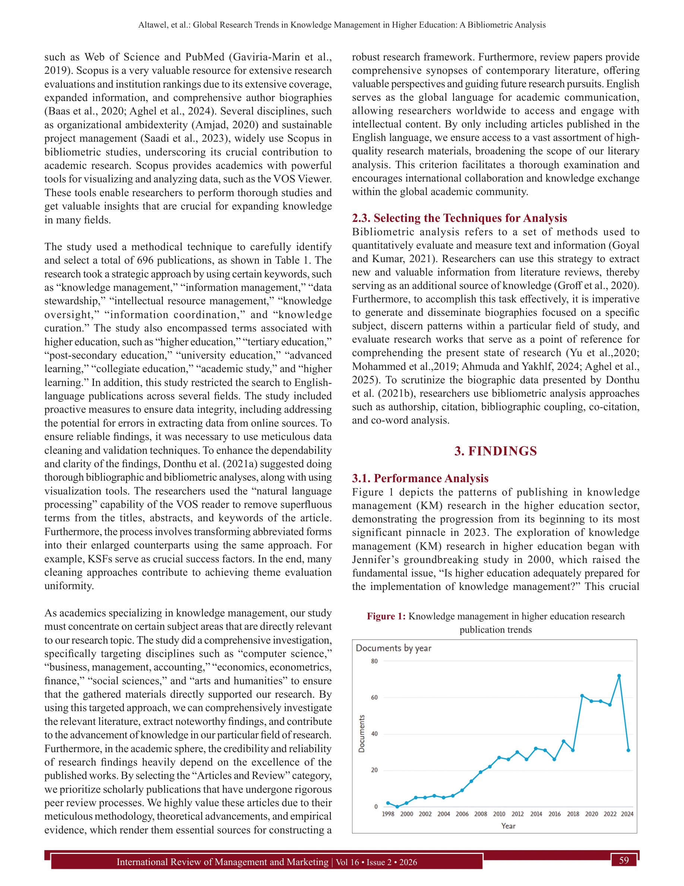
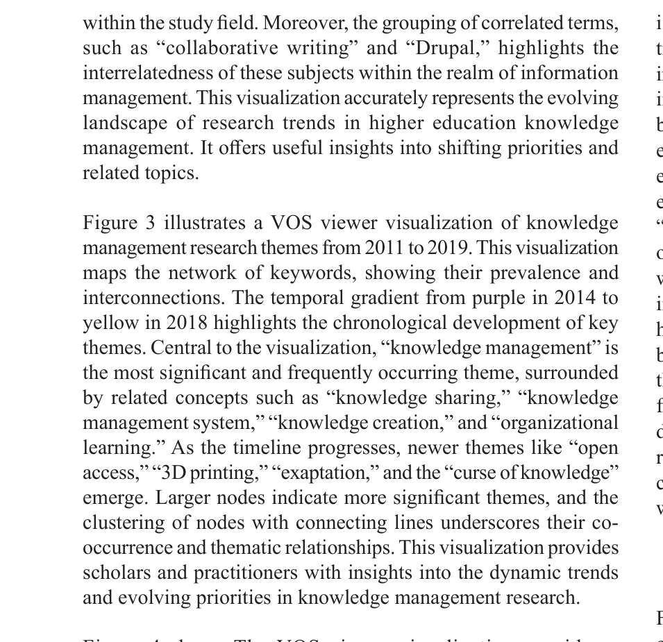

# A bibliometric analysis of bouldering and climbing research articles in the Scopus database

> **저자**: Daniel González Devesa | **날짜**: 2026-03-20 | **DOI**: [10.5281/ZENODO.17859553](https://doi.org/10.5281/ZENODO.17859553)

---

## Essence

*Figure 1: Knowledge management in higher education research*

본 연구는 Scopus 데이터베이스에서 1998년부터 2024년까지 고등교육기관(HEIs)의 지식관리(KM) 연구 696건을 bibliometric analysis로 분석하여 KM 연구의 진화, 영향력 있는 기여자, 신흥 주제 추세를 규명하였다.

## Motivation

- **Known**: Knowledge management는 고등교육기관의 조직 성과 향상에 중요하며, Knowledge-Based View(KBV) 이론은 지식을 경쟁우위의 핵심 자원으로 강조한다. Scopus 데이터베이스를 활용한 bibliometric analysis는 연구 동향 파악의 표준적 방법론이다.
- **Gap**: 기존 KM 연구들은 제한된 저널, 방법론, 또는 좁은 연구 영역에 집중되어 있으며, 고등교육 부문에서의 KM 영향에 대한 포괄적 분석이 부족하다. AI와 디지털 변환을 포함한 신흥 기술이 KM에 미치는 영향에 대한 연구가 제한적이다.
- **Why**: 고등교육기관에서 효과적인 KM은 교수, 학습, 행정 프로세스를 최적화하고 혁신을 주도하며 지식 기반 경제에서의 경쟁력을 확보하는 데 필수적이다. 거시적 연구 동향 분석은 기관의 전략적 의사결정과 KM 전략 개발을 안내한다.
- **Approach**: Performance analysis(h-index, 인용 수, 생산성)와 science mapping(키워드 분석, 공동 인용 분석, 주제 매핑, 네트워크 협력 연구)을 포함한 정량적·정성적 bibliometric 기법을 적용하고, VOS-viewer를 활용한 과학 시각화로 지적 구조와 연구 클러스터를 파악하였다.

## Achievement

*Figure 3 illustrates a VOS viewer visualization of knowledge*

* **KM 연구 성장 추세**: 2023년 72편으로 최고 피크를 기록하여 지난 25년간 KM 연구의 가속화된 성장을 입증
* **영향력 있는 기여자 규명**: Northwestern Polytechnical University가 인용 임팩트에서 탁월하고 United Kingdom이 가장 생산적인 기여국으로 식별
* **중요 학술지 파악**: Computers and Education이 출판량에서 선도적이며, 가장 인용된 논문은 HEIs의 KM readiness 다룸
* **신흥 연구 방향**: AI와 디지털 변환이 향후 유망한 연구 방향으로 부상하여 기술-KM 융합의 필요성 제시

## How

*Figure 2: Influential topics in the “period of 1998-2010”*

* Scopus 데이터베이스에서 1998-2024년 검색어를 통해 696편의 peer-reviewed 논문 수집
* Co-authorship networks와 keyword co-occurrence 분석으로 협력 패턴 및 개념 간 관계 규명
* VOS-viewer를 활용한 과학 지도화로 연구 클러스터와 지적 구조 시각화
* H-index, citation counts 등 performance indicators로 개별 논문, 저자, 기관의 영향력 평가
* Bibliographic coupling과 co-citation analysis로 논문 간 지적 연결성 파악

## Originality

* HEIs의 KM에 특화된 포괄적 25년 longitudinal bibliometric analysis로 기존의 단편적 연구 범위 확장
* Knowledge-Based View(KBV) 이론 프레임워크와 bibliometric 방법론의 체계적 통합을 통해 KM 전략 발전을 위한 이론적 근거 제시
* AI와 디지털 변환의 신흥 역할을 규명하여 차세대 KM 연구 방향 선정에 기여
* 여성 매니저의 KM 역할 등 구체적 지역적 한계(특히 중동 지역)를 식별하여 포용적 KM 전략 필요성 제기

## Limitation & Further Study

* Scopus 데이터베이스만 활용하여 다른 학술 데이터베이스(Web of Science 등)의 논문을 누락할 가능성
* Citation counts와 h-index 등 bibliometric 메트릭스의 methodology-dependent 특성으로 인한 해석의 편향 가능성
* 696편 분석의 시간적·지역적 분포 불균형으로 일부 지역/기간의 KM 연구 대표성 제한 가능
* 후속 연구로 AI-기반 KM 시스템 구현의 실제 효과성 검증, 중동/아프리카 지역의 여성 리더십 KM 사례 연구, 여러 데이터베이스 통합 분석 필요

## Evaluation

- Novelty: 4/5
- Technical Soundness: 4/5
- Significance: 4/5
- Clarity: 4/5
- Overall: 4/5

**총평**: 본 연구는 고등교육의 KM 연구 전체 지형을 25년에 걸쳐 체계적으로 분석하고, Knowledge-Based View 이론과 정교한 bibliometric 방법론을 결합하여 연구 동향, 기여자, 신흥 기술을 종합적으로 규명한 가치 있는 메타분석이다. AI와 디지털 변환의 역할 부각은 향후 HEIs의 KM 전략 수립에 실질적 가이던스를 제공하는 의의를 지닌다.

## Related Papers

- 🔄 다른 접근: [[papers/1132_A_bibliometric_analysis_of_the_traditional_African_dental_pr/review]] — 볼더링/클라이밍 연구의 서지분석과 아프리카 전통 치과 실습 연구 분석이 모두 특정 도메인에 특화된 서지계량학적 접근을 보여줍니다.
- 🔗 후속 연구: [[papers/972_Identifying_interdisciplinary_emergence_in_the_science_of_sc/review]] — 고등교육 지식관리 연구의 학제간 특성을 파악하는데 과학의 학제간 출현 식별 방법론이 유용한 확장을 제공할 수 있습니다.
